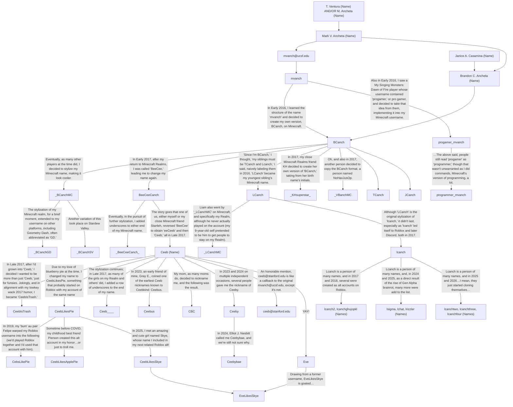

```mermaid
flowchart TD

    %% pre-mvanch
    Parents["T. Ventura (Name) AND/OR M. Ancheta (Name)"] --> Ancheta
    Ancheta["Mark V. Ancheta (Name)"] --> UCSF["mvanch@ucsf.edu"]
    Ancheta --> Brandon["Brandon C. Ancheta (Name)"] --> B
    Casamina["Janice A. Casamina (Name)"] --> Brandon
    UCSF --> m[mvanch]    

    %% mvanch era
    m -->|"In Early 2016, I learned the structure of the name 'mvanch' and decided to create my own version, BCanch, on Minecraft."| B[BCanch]
    m -->|"Also in Early 2016, I saw a My Singing Monsters: Dawn of Fire player whose username contained 'progamer,' or pro gamer, and decided to take that idea from them, implementing it into my Minecraft username."| progamer_mvanch -->|"…The above said, people still read 'progamer' as 'programmer,' though that wasn't unwarranted as I did commands, Minecraft's version of programming, a lot."| programmer_mvanch

    %% BCANCH era
    B -->|"Eventually, as many other players at the time did, I decided to stylize my Minecraft name, making it look cooler."| _B[_BCanchMC]
    B -->|"In Early 2017, after my return to Minecraft Realms, I was called 'BeeCee,' leading me to change my name again."| BCC[BeeCeeCanch]
    _B -->|"The stylization of my Minecraft realm, for a brief moment, extended to my username on other platforms, including Geometry Dash, often abbreviated as 'GD.'"| _BCanchGD
    _B -->|"Another variation of this took place on Stardew Valley."| _BCanchSV
    BCC -->|"Eventually, in the pursuit of further stylization, I added underscores to either end of my Minecraft name."| _BeeCeeCanch_
    BCC -->|"The story goes that one of us, either myself or my close Minecraft friend Stanleh, reversed 'BeeCee' to obtain 'eeCeeb' and then 'Ceeb,' all in Late 2017."| C["Ceeb (Name)"]

    %% Ceeb era
    C -->|"In Late 2017, after I'd grown into 'Ceeb,' I decided I wanted to be more than just 'Ceeb,' just for funsies. Jokingly, and in alignment with my lowkey wack 2017 humor, I became 'CeebIsTrash.'"| CeebIsTrash
    C -->|"Due to my love of blueberry pie at the time, I changed my name to CeebLikesPie, something that probably started on Roblox with my account of the same name"| CLP[CeebLikesPie]
    C -->|"The stylization continues; in Late 2017, as many of the girls on my Realm and others' did, I added a row of underscores to the end of my name."| Ceeb____
    CLP -->|"In 2019, my 'bum' au pair Felipe warped my Roblox username into the following (we'd played Roblox together and I'd used that account with him)."| CebsLikePie
    CLP -->|"Sometime before COVID, my childhood best friend Pierson created this alt account in my honor…or just to troll me."| CeebLikesApplePie
    CLP -->|"In 2025, I met an amazing and cute girl named Skye, whose name I included in my next related Roblox alt!"| CeebLikesSkye
    C -->|"In 2023, an early friend of mine, Gray E., coined one of the earliest Ceeb nicknames known to Ceebkind: Ceebus."| Ceebus
    C -->|"My mom, as many moms do, decided to nickname me, and the following was the result."| CBC
    C -->|"In 2023 and 2024 on multiple independent occasions, several people gave me the nickname of Ceeby."| Ceeby
    Ceeby -->|"In 2024, Elliot J. Nesbitt called me Ceebybae, and we're still not sure why."| Ceebybae
    C -->|"An honorable mention, ceeb@stanford.edu is like a callback to the original mvanch@ucsf.edu, except it's not."| CS["ceeb@stanford.edu"]

    %% Eve era
    C -->|"YAY!"| E[Eve]
    E -->|"Drawing from a former username, EveLikesSkye is goated…"| EveLikesSkye
    CeebLikesSkye --> EveLikesSkye

    %% Other canches
    B -->|"'Since I'm BCanch,' I thought, 'my siblings must be TCanch and Lcanch,' I said, naively labeling them in 2016. 'LCanch' became my youngest sibling's Minecraft name."| LC[LCanch]
    LC -->|"Liam also went by '_LCanchMC' on Minecraft, and specifically my Realm, although he never actually played on the account (my 9-year-old self pretended to be him to get people to stay on my Realm)."| _LCanchMC
    LC -->|"Although 'LCanch' is the original stylization of 'lcanch,' it didn't last, especially as 'lcanch' led itself to Roblox and later Discord, both in 2017."| l[lcanch]
    l -->|"Lcanch is a person of many names, and in 2017 and 2018, several were created as alt accounts on Roblox."| lcsA["lcanch2, lcanchghujopkl (Names)"]
    l -->|"Lcanch is a person of many names, and, in 2024 and 2025, as a direct result of the rise of Gen Alpha brainrot, many more were add to the list."| lcsB["lsigma, lchat, lrizzler (Names)"]
    l -->|"Lcanch is a person of many names, and in 2025 and 2026…I mean, they just started cloning themselves…"| lcsC["lcanchtwo, lcanchthree, lcanchfour (Names)"]
    B -->|"In 2017, my close Minecraft Realms friend KH decided to create her own version of 'BCanch,' taking from her birth name's initials."| _KHsuperstar_
    B -->|"Oh, and also in 2017, another person decided to copy the BCanch format, a person named NoHaxJusOp."| _VBanchMC
    B --> TCanch
    B --> JCanch
```
